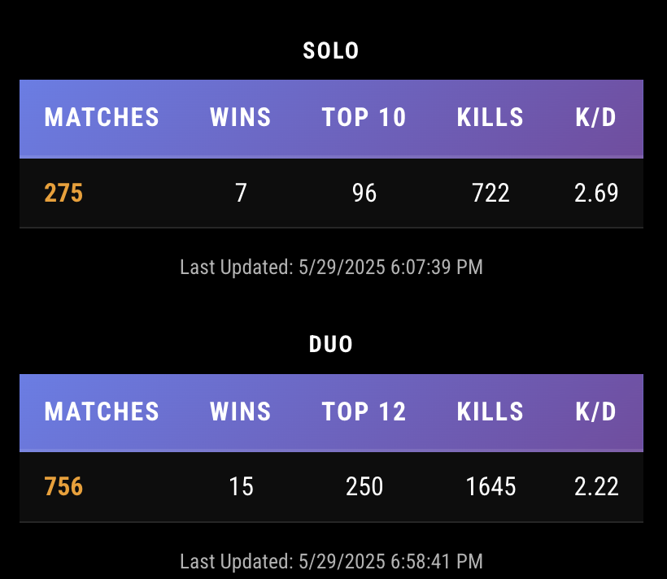
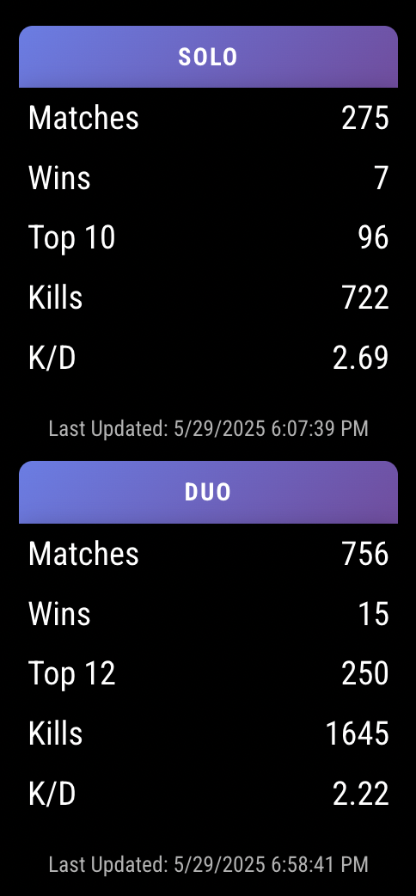

# MMM-fortnite-stats
This MagicMirror module adds your fornite stats to your mirror! It uses https://fortniteapi.io/ for the data and you can get a free API Key.






## Install

In your terminal, go to your [MagicMirror²][mm] Module folder and clone MMM-fortnite-stats:

```bash
cd ~/MagicMirror/modules
git clone https://github.com/sebastian-ch/MMM-fortnite-stats.git
cd ~/MMM-fortnite-stats
npm install
```

## Update

```bash
cd ~/MagicMirror/modules/MMM-fortnite-stats
git pull
```

## Using the module

To use this module, add it to the modules array in the `config/config.js` file:

```js
    {
		module: 'MMM-fortnite-stats',
		position: 'top_right',
		config: {
			username: 'Ninja',
			apiKey: 'api-key-here',
			updateInterval: 1800000,
			showSolo: true,
			showDuo: true,
			displayDirection: 'horizontal' // or vertical
		},

	},
```

## Configuration options

Option|Possible values|Default|Description
------|------|------|-----------
`username`|`string`|Ninja|your epic account username
`apiKey`|`string`||your api key from https://fortniteapi.io/
`showSolo`|`boolean`|true |show your Solo stats
`showDuo`|`boolean`|true| show your Duo stats
`updateInterval`| `number` | 1800000 | default is 30 minutes, the data from the api updates sporadically


## Comments
- horizontal and vertical displays work well on my large mirror, if there are issues on smaller mirrors let me know!
- I've only really tested in the left and right placements - not at the top or bottom
- Please let me know if there are other stats you'd like to see. Also see the documentation at the API (https://fortniteapi.io/) to see what is available.
- feel free to make a pull request for changes!


## Developer commands

- `npm install` - Install devDependencies like ESLint.
- `npm run lint` - Run linting and formatter checks.
- `npm run lint:fix` - Fix linting and formatter issues.

[mm]: https://github.com/MagicMirrorOrg/MagicMirror
